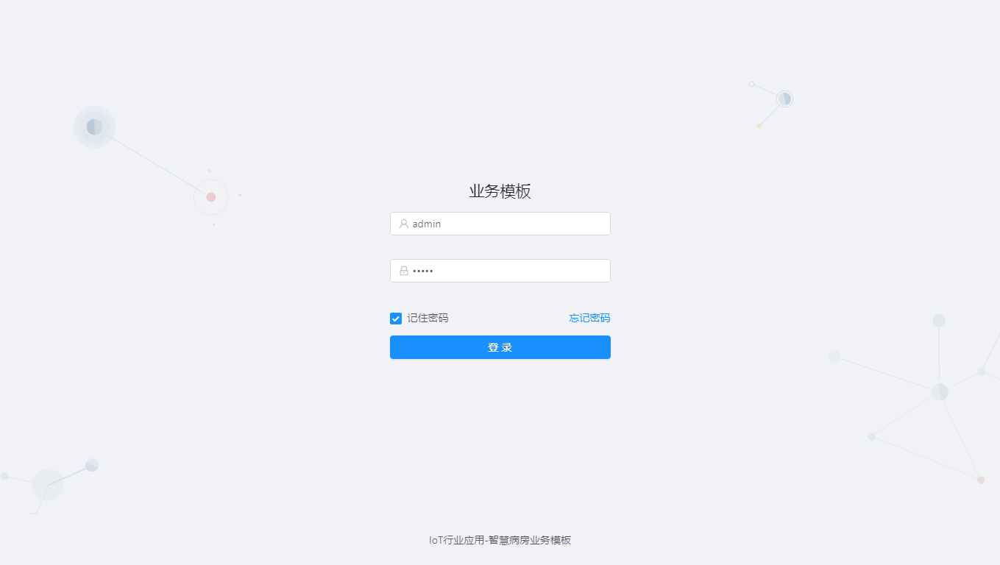
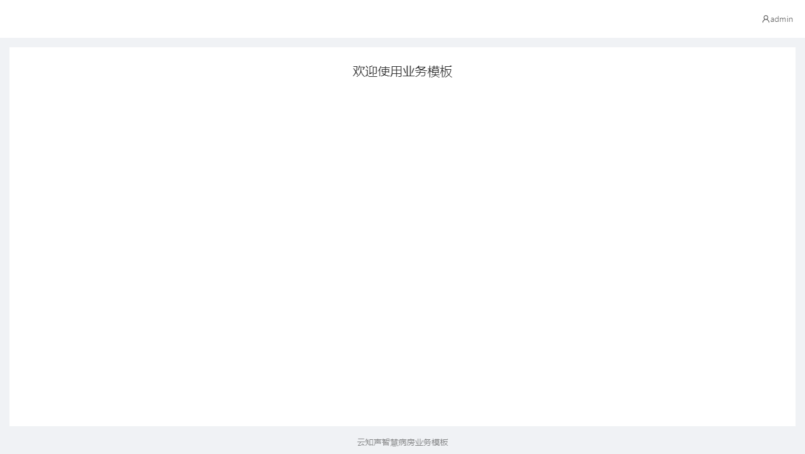

## app-template
智慧病房前端业务模板
1. 项目获取
```
git clone http://gitlab-iot.yzs.io/lucky/app-template.git
```
2. 进入文件夹，安装依赖
```
cd app-template

yarn(推荐) 或 npm i
```   
3. 启动本地开发环境
```  
yarn start(推荐) 或 npm start
```  
4. 打包
```
yarn build(推荐) 或 npm run build
```
## 项目预览



## 如何开发业务
1. 业务开发只需要修改src内的代码

2. pages文件夹里，login为登录页、welcome为基础页(开发业务前自行删除)

3. 如果对接真实后端数据接口，打开.umirc.js 修改代理proxy为接口所在的ip及端口号;

## 注意

禁止向模板主分支提交代码

设置为新项目需修改远程仓库地址

```
    // 方法1
    git remote rm origin
    git remote add origin [url]
    // 方法2
    git remote origin set-url [url]
```


